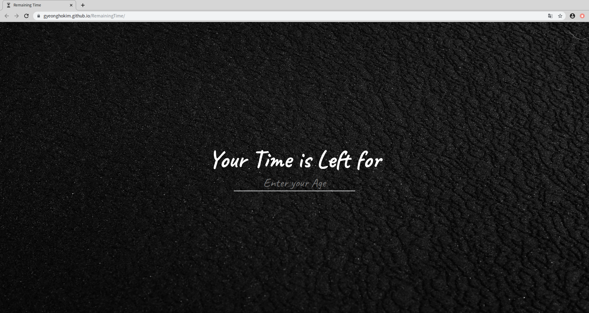
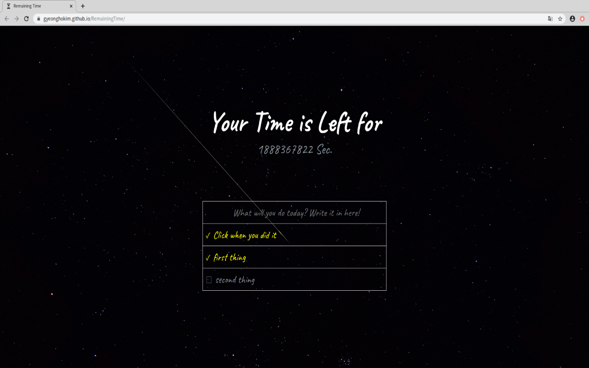

# Remaining Time

"Remaining Time" is a chrome extension program for pressuring lazy people.

* Count Down: "Left Time" shows your life time into seconds and reminds that you do not have much time for waste!

* To-do list: You can add your to-do list. Do not waste your time, focus on your goal.

# Installation

## Chrome Extension

[chrome extension link](https://chrome.google.com/webstore/detail/remaining-time/pbipdikihhcimlmbgneoioncgbndonpn)

### manual installation

1. Enter `chrome://extensions/`
2. Toggle "Developeer Mode"
3. Upload local folder(download zip file from github first)

## Web site

https://gyeonghokim.github.io/RemainingTime/

# Version

## version 1.0

made with Vanilla Java Script

### screen shots

# License

[MIT licensed](./LICENSE)
